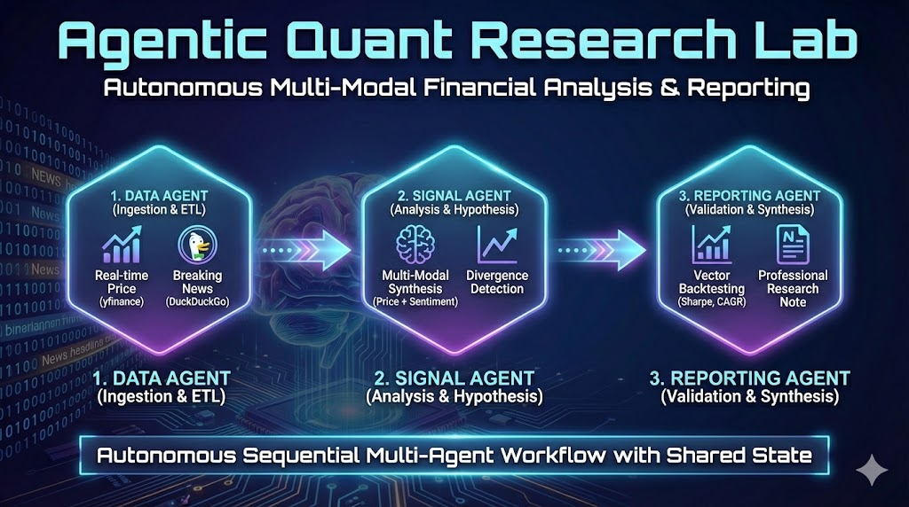

# Agentic Quant Research Lab

## 1. Problem Statement: The "Analyst's Bottleneck"
Quantitative research is traditionally a disjointed process. Traders must bridge the gap between **hard numerical data** (price action, volatility) and **soft qualitative data** (news sentiment, macro narratives).
* **The Pain Point:** Manually fetching OHLCV data, cleaning it, reading hundreds of headlines, and running backtests across multiple tickers is slow and error-prone.
* **The Scaling Issue:** A human analyst cannot monitor hundreds of tickers simultaneously for specific signal divergences (e.g., "Price is rising despite negative news").
* **The Goal:** Automate the "grunt work" of data ingestion, feature engineering, and initial signal detection so humans can focus on high-level strategy.

  

## 2. Solution: The Agentic Workflow
The **Agentic Quant Research Lab** is an autonomous system that executes the full lifecycle of preliminary market research.
* **Multi-Modal Ingestion:** It gathers real-time market prices and breaking news simultaneously.
* **Cognitive Synthesis:** It uses LLM reasoning to cross-reference technical indicators (Math) with news sentiment (Language).
* **Validation:** It validates hypotheses through vector-based backtesting, ensuring ideas are mathematically sound before reporting.
* **Output:** It generates a professional, structured Research Note, ready for human review.

---

## 3. System Architecture
This project moves beyond simple "chatbot" architectures by implementing a **Sequential Multi-Agent System**. It functions as an assembly line where specialized agents hand off tasks to one another.

### The Orchestrator: `AgenticQuantLab_Workflow`
* **Pattern:** `SequentialAgent`
* **Model:** `gemini-2.5-flash` (Chosen for high throughput and low latency).
* **State Management:** Instead of passing massive data blobs through the LLM context window (which causes hallucinations and high costs), this system uses a **Shared Session State** (`ToolContext`). Agents read/write heavy data (DataFrames) to the state, passing only lightweight status messages to one another.

### The Specialist Agents

#### Data Engineer: `Quant_Data_Agent`
* **Role:** Extract-Transform-Load (ETL).
* **Key Innovation:** Implements **Robust Tooling**.
    * *Price Data:* Fetches via `yfinance`.
    * *News Data:* Fetches via `duckduckgo_search` with a **Fallback Mechanism**. If live search is rate-limited (common in cloud environments), it degrades gracefully to cached data rather than crashing the workflow.

#### Signal Analyst: `Quant_Signal_Research_Agent`
* **Role:** Pattern Recognition & Hypothesis Generation.
* **Logic:** It synthesizes multi-modal inputs. For example, if Momentum is Positive but News is Negative, it identifies a **"Climbing a Wall of Worry"** scenario—a sophisticated market signal that simple regression models miss.

#### Reporter: `Quant_Reporting_Agent`
* **Role:** Validation & Communication.
* **Tools:** Uses `local_backtest` to calculate Sharpe Ratio, CAGR, and Max Drawdown.
* **Output:** Synthesizes technicals, sentiment, and backtest metrics into a formatted markdown report.

---

## 4. Key Engineering Challenges & Solutions

### Challenge A: Context Window Bloat
* **Problem:** Passing 250 days of daily price data through the LLM context window is expensive and confusing for the model.
* **Solution:** Implemented **State-Based Tooling**. The `fetch_market_data` tool saves the DataFrame directly to `context.state['market_data']`. The downstream `compute_simple_factors` tool reads directly from that state. The LLM never sees the raw numbers, only the summary statistics.

### Challenge B: API Reliability
* **Problem:** External scrapers (like `yfinance` news) often break or get rate-limited in Colab environments.
* **Solution:** Engineered a **Circuit Breaker** pattern. If the primary news source returns an empty list or error, the tool catches the exception and provides a "No News" status or fallback data, allowing the agent to continue its analysis (noting the limitation in the final report) rather than crashing.

### Challenge C: Safety & Liability
* **Problem:** An autonomous financial agent poses a risk of generating harmful financial advice.
* **Solution:** Built a custom **ADK Plugin** (`NoTradeAdviceGuardrail`). This intercepts user messages *before* they reach the agent. If a user asks to "Go all in" or requests specific "Buy/Sell" advice, the guardrail logs a warning and can be configured to block the request, ensuring **Responsible AI** compliance.

---

## 5. Observability & Metrics
The system is fully instrumented using the ADK's `LoggingPlugin`.
* **Traceability:** Every step of the chain (Data -> Signal -> Report) is logged with a unique Invocation ID.
* **Transparency:** Tool inputs and outputs are visible in the logs, allowing us to verify *why* the agent chose a specific factor.
* **Audit Trail:** The final session state is persisted to a Memory Service, creating an audit trail of all research conducted.

---

## 6. Future Roadmap

If I extend the Agentic Quant Research Lab beyond this blueprint, I’d:

- **Integrate a Vector Database for "Market Memory"**
  - Swap `InMemoryMemoryService` for `Vertex AI Vector Search`.
  - Allow the agent to recall historical market regimes (e.g., "This setup looks like the 2020 crash") to provide deeper context.

- **Add a "Human-in-the-Loop" Approval Step**
  - Pause the workflow after the Signal Agent proposes a hypothesis.
  - Present the hypothesis to the human trader.
  - Only proceed to the expensive Backtest phase if the human clicks "Approve."

- **Expand Tooling to Fundamentals**
  - Add a tool to fetch SEC filings (10-K, 10-Q) via EDGAR.
  - Allow the agent to analyze balance sheet health alongside price action.

- **Live Paper Trading**
  - Connect the final output to a paper-trading API (like Alpaca).
  - Allow the agent to execute the trade in a sandbox environment if the backtest metrics exceed a certain threshold.

That roadmap would turn the Agentic Quant Research Lab from a powerful analysis tool into a fully autonomous algorithmic trading assistant.
